# ModuMake AI Review DB Schema

이 문서는 `.kicad_sch + firmware code` 기반의 하드웨어/소프트웨어 교차 검증 파이프라인을 저장하기 위한 데이터베이스 구조 초안입니다.

핵심 원칙은 세 가지입니다.

- 분석 입력은 다시 재현할 수 있어야 한다.
- 자주 재사용되는 부품 정보는 캐시되어야 한다.
- 검증 결과와 추천 결과는 쿼리 가능해야 한다.

## 핵심 판단

지금 제안하신 구조는 전반적으로 맞습니다. 특히 아래 세 가지는 아주 좋습니다.

- `PART_MASTER`를 별도 캐시 테이블로 분리하는 것
- `ERROR_FINDINGS`와 `SUBSTITUTE_SUGGESTIONS`를 분리하는 것
- `API_KEYS`와 `API_USAGE_LOGS`를 과금 축으로 독립시키는 것

다만 운영 안정성을 위해 아래 두 가지는 같이 넣는 편이 좋습니다.

1. `VALIDATION_JOBS.integrated_model_json`
   - Claude에 실제로 보낸 통합 회로 모델 JSON 전체를 스냅샷으로 저장합니다.
   - 나중에 “왜 이 결과가 나왔는지” 재현할 수 있습니다.

2. `CODE_PIN_USAGES`
   - `code_pin_usage`를 JSON 안에만 묻지 말고 행 단위로도 저장합니다.
   - “어떤 프로젝트에서 자주 핀 불일치가 나는가” 같은 검색이 쉬워집니다.

## Mermaid ERD

```mermaid
erDiagram
    ACCOUNTS {
        uuid id PK
        text name
        text plan_tier
        text billing_email
        timestamptz created_at
    }

    API_KEYS {
        uuid id PK
        uuid account_id FK
        text label
        text key_prefix
        text key_hash
        boolean is_active
        timestamptz created_at
        timestamptz revoked_at
    }

    API_USAGE_LOGS {
        uuid id PK
        uuid api_key_id FK
        text endpoint
        text model_name
        integer request_count
        integer input_tokens
        integer output_tokens
        numeric estimated_cost_usd
        integer response_ms
        text status
        timestamptz created_at
    }

    PROJECTS {
        uuid id PK
        uuid owner_user_id
        uuid account_id FK
        text title
        text source_kind
        jsonb state_json
        timestamptz created_at
        timestamptz updated_at
    }

    CODE_ARTIFACTS {
        uuid id PK
        uuid project_id FK
        text language
        text file_name
        text source_sha256
        text source_code
        timestamptz created_at
    }

    VALIDATION_JOBS {
        uuid id PK
        uuid project_id FK
        uuid code_artifact_id FK
        text status
        text source_kind
        jsonb integrated_model_json
        jsonb validation_flags_json
        integer component_count
        integer net_count
        integer issue_count
        text failure_reason
        timestamptz created_at
        timestamptz completed_at
    }

    COMPONENT_INSTANCES {
        uuid id PK
        uuid validation_job_id FK
        uuid matched_part_id FK
        text refdes
        text lib_id
        text symbol_name
        text value
        text footprint
        text mpn_candidate
        jsonb pin_net_map
        jsonb metadata_json
        timestamptz created_at
    }

    CODE_PIN_USAGES {
        uuid id PK
        uuid validation_job_id FK
        text operation_type
        text pin_argument
        text matched_mcu_pin_label
        integer line_number
        text scope
        text mode
        text value
        boolean conditional
        jsonb conditions_json
        jsonb call_path_json
    }

    PART_MASTER {
        uuid id PK
        text canonical_mpn
        text manufacturer_name
        text normalized_part_name
        text datasheet_url
        text lifecycle_status
        jsonb pin_schema_json
        jsonb specs_json
        timestamptz last_synced_at
        timestamptz created_at
    }

    ERROR_FINDINGS {
        uuid id PK
        uuid validation_job_id FK
        uuid component_instance_id FK
        text source_engine
        text severity
        text finding_code
        text title
        text message
        text board_pin
        text net_label
        integer line_number
        text recommendation
        jsonb evidence_json
        timestamptz created_at
    }

    SUBSTITUTE_SUGGESTIONS {
        uuid id PK
        uuid error_finding_id FK
        uuid suggested_part_id FK
        text suggested_mpn
        text source_api
        numeric compatibility_score
        text reason
        text purchase_url
        jsonb raw_vendor_payload
        timestamptz created_at
    }

    ACCOUNTS ||--o{ API_KEYS : issues
    API_KEYS ||--o{ API_USAGE_LOGS : logs
    ACCOUNTS ||--o{ PROJECTS : owns
    PROJECTS ||--o{ CODE_ARTIFACTS : stores
    PROJECTS ||--o{ VALIDATION_JOBS : runs
    CODE_ARTIFACTS ||--o{ VALIDATION_JOBS : analyzed_in
    VALIDATION_JOBS ||--o{ COMPONENT_INSTANCES : extracts
    VALIDATION_JOBS ||--o{ CODE_PIN_USAGES : extracts
    VALIDATION_JOBS ||--o{ ERROR_FINDINGS : produces
    PART_MASTER ||--o{ COMPONENT_INSTANCES : matches
    COMPONENT_INSTANCES ||--o{ ERROR_FINDINGS : triggers
    ERROR_FINDINGS ||--o{ SUBSTITUTE_SUGGESTIONS : suggests
    PART_MASTER ||--o{ SUBSTITUTE_SUGGESTIONS : recommends
```

## 테이블 역할 요약

### `PROJECTS`

- 사용자가 실제로 열고 저장하는 회로도 단위입니다.
- 현재 앱의 `state_json` 저장 구조와 자연스럽게 이어집니다.

### `CODE_ARTIFACTS`

- `.ino`, `.c`, `.cpp`, `.py` 같은 코드 입력 원본입니다.
- 같은 프로젝트라도 코드가 바뀔 수 있으니 분리해두는 편이 좋습니다.

### `VALIDATION_JOBS`

- 한 번의 분석 실행 단위입니다.
- `status`는 아래 값으로 충분합니다.
  - `pending`
  - `parsing`
  - `analyzing`
  - `completed`
  - `failed`
- 가장 중요한 컬럼은 `integrated_model_json`입니다.
  - 여기에는 Claude로 실제 전송된 `components / nets / code_pin_usage / validation_flags` 전체 스냅샷이 들어갑니다.

### `COMPONENT_INSTANCES`

- KiCad 파서가 뽑아낸 부품 인스턴스입니다.
- `pin_net_map`에 `components + nets`의 연결 정보를 유연하게 저장합니다.
- `matched_part_id`는 `PART_MASTER`와 연결되는 캐시 참조입니다.

### `CODE_PIN_USAGES`

- 코드 파서가 뽑아낸 `pinMode`, `digitalWrite`, `analogRead` 같은 핀 사용 기록입니다.
- `matched_mcu_pin_label IS NULL`이면 회로도와 코드가 어긋난 후보입니다.

### `PART_MASTER`

- Digi-Key / Octopart / 공식 데이터시트에서 한번 가져온 부품 메타데이터 캐시입니다.
- 같은 MPN을 여러 프로젝트에서 반복 조회하지 않게 해줍니다.

### `ERROR_FINDINGS`

- 룰 기반 엔진과 AI 분석 결과를 한 테이블에 모읍니다.
- `source_engine` 예시:
  - `rule_based`
  - `formal_verifier`
  - `datasheet_ai`

### `SUBSTITUTE_SUGGESTIONS`

- 하나의 문제에 여러 대체 부품 후보가 붙는 구조입니다.
- `source_api`로 벤더 소스를 구분합니다.

### `API_KEYS` / `API_USAGE_LOGS`

- B2B 과금용입니다.
- 중요한 점은 `API_KEYS`에 원문 키를 저장하지 말고 `key_hash`만 저장하는 것입니다.

## 왜 이 구조가 좋은가

### 1. JSON과 정규화 테이블을 같이 간다

`integrated_model_json` 하나만 있으면 빠르게 개발할 수 있습니다.
하지만 운영에 들어가면 “어떤 핀 충돌이 가장 자주 나는가”, “어떤 부품이 자주 단종 추천을 받는가” 같은 질의가 필요해집니다.

그래서:

- 재현성은 `VALIDATION_JOBS.integrated_model_json`
- 검색성과 통계는 `COMPONENT_INSTANCES`, `CODE_PIN_USAGES`, `ERROR_FINDINGS`

이렇게 이중 구조로 가는 게 가장 현실적입니다.

### 2. `PART_MASTER` 캐시가 API 비용을 줄인다

같은 `ATmega328P`, `ESP32-WROOM-32E`, `AMS1117`는 여러 프로젝트에 반복해서 등장합니다.
매번 외부 API를 부르면 느리고 비쌉니다.

그래서:

- 프로젝트별 인스턴스는 `COMPONENT_INSTANCES`
- 전역 캐시는 `PART_MASTER`

로 나누는 것이 맞습니다.

### 3. 에러와 추천을 분리해야 리포트가 좋아진다

실제 발표용 리포트나 PDF에서는:

- 문제
- 근거
- 대안

이 분리되어야 읽힙니다.

그래서 `ERROR_FINDINGS`와 `SUBSTITUTE_SUGGESTIONS`를 분리한 건 아주 좋은 판단입니다.

## 바로 적용할 때 추천 인덱스

운영 초기에 가장 체감 큰 인덱스는 이 정도입니다.

- `validation_jobs (project_id, created_at desc)`
- `component_instances (validation_job_id)`
- `component_instances (matched_part_id)`
- `error_findings (validation_job_id, severity)`
- `error_findings (component_instance_id)`
- `code_pin_usages (validation_job_id, pin_argument)`
- `part_master (canonical_mpn)`
- `api_usage_logs (api_key_id, created_at desc)`

그리고 JSON 검색용으로는:

- `component_instances.pin_net_map`에 `GIN`
- `validation_jobs.integrated_model_json`에 `GIN`

정도는 바로 준비하는 편이 좋습니다.

## 추천 구현 순서

이 순서가 제일 안전합니다.

1. `PROJECTS`
2. `CODE_ARTIFACTS`
3. `VALIDATION_JOBS`
4. `COMPONENT_INSTANCES`
5. `CODE_PIN_USAGES`
6. `ERROR_FINDINGS`
7. `PART_MASTER`
8. `SUBSTITUTE_SUGGESTIONS`
9. `API_KEYS`
10. `API_USAGE_LOGS`

한 줄로 줄이면 이렇습니다.

`입력 저장 -> 분석 스냅샷 저장 -> 결과 저장 -> 캐시/과금 확장`

