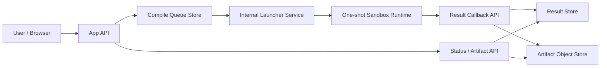

# Compile Production Deployment Spec

작성일: 2026-06-29

## 목적

이 문서는 현재 로컬/내부 검증용 compile sandbox 경계를 production 배포 구조로 올릴 때 필요한 최소 아키텍처를 고정한다.

대상은 ModuMake의 cloud compile 경로 전체다.

1. App API
2. Queue / claim 경계
3. Launcher service
4. One-shot runtime
5. Result / artifact storage

## 현재 판정

현재 저장소는 다음까지는 완료되어 있다.

- app queue -> sandbox launch request -> launcher queue -> one-shot runtime contract
- Docker CLI one-shot backend로 local/internal smoke 검증
- artifact 분리 저장 + signed download path
- Supabase RPC-first claim/update

하지만 production-ready deployment는 아직 아니다.

- `docker-cli-one-shot`는 local/internal runtime이다.
- multi-node queue 경쟁 제어는 Supabase RPC 수준이다.
- artifact/object storage retention, auth, quota는 문서 기준은 있으나 지속 저장소 기반 enforcement와 cleanup worker가 아직 완성되지 않았다.
- production 환경에서 예시 placeholder secret은 compile/shared token과 artifact download secret으로 사용할 수 없다.

## 목표 아키텍처



## 배포 원칙

1. compile backend는 public internet에 직접 노출하지 않는다.
2. 각 compile job은 일회성 runtime 하나에서만 실행한다.
3. compile phase는 network disabled가 기본이다.
4. runtime은 non-root / read-only rootfs / no capabilities를 강제한다.
5. artifact와 log는 queue metadata와 분리한다.

## 권장 프로덕션 형태

### 권장 순서

1. **App API**
   - Next.js app 또는 별도 API service
   - public ingress 허용
   - auth / rate limit / request normalization 담당

2. **Queue**
   - 단순 Postgres row queue를 넘어서 전용 queue service 또는 stronger RPC 사용
   - 후보:
     - Postgres RPC + advisory lock
     - SQS + DynamoDB metadata
     - Cloud Tasks
     - Redis streams

3. **Launcher service**
   - internal-only service
   - `/api/v1/sandbox-launch`만 노출
   - request validation + runtime spec normalization + launch submission 담당

4. **One-shot runtime**
   - 권장 후보:
     - AWS Fargate task-per-job
     - Kubernetes Job + gVisor/Kata
     - Firecracker-backed microVM runner
   - 비권장:
     - 장기 실행 shared Docker host를 보안 경계로 간주하는 방식

5. **Artifact store**
   - object storage 우선
   - 후보:
     - S3
     - Supabase Storage
     - GCS

## 환경별 기준

### Local / internal

- executor: `docker-cli-one-shot`
- runtime image: `modumake/compile-sandbox-runtime:local`
- queue/result/artifact: file or Supabase

### Beta

- public cloud compile은 기본 off
- allowlisted staff/project만 enable
- executor는 already sandboxed one-shot runtime이어야 한다
- object storage + retention + auth가 붙어 있어야 한다

### Production

- `MODUMAKE_ENABLE_UNSANDBOXED_COMPILE=false` 유지
- `compile-server-proxy` 금지
- launcher runtime은 Fargate/K8s/gVisor/Firecracker 중 하나
- artifact store는 object storage only
- signed download TTL / quota / GC 정책 필수

## 네트워크 경계

### Public ingress

- app API만 허용
- WAF / CDN / rate limit 적용

### Private network

- app API -> queue store
- app API -> internal launcher route
- launcher service -> runtime control plane
- runtime -> result callback API
- result API -> object store

### 금지

- public -> compile server direct access
- public -> launcher service direct access
- runtime -> open internet compile phase access

## Runtime 요구사항

### 필수

- non-root user
- read-only rootfs
- writable tmpfs workspace only
- `no-new-privileges`
- `drop all capabilities`
- `network disabled` during compile phase
- CPU / memory / pids / wall-clock / disk 제한

### 권장

- seccomp / AppArmor / gVisor / Kata
- host path mount 금지
- runtime secret 주입 최소화
- image digest pinning

## Image 전략

### Local image

- `npm run build:sandbox-runtime-image`
- AVR-only
- smoke / developer validation용

### Full image

- `npm run build:sandbox-runtime-image:full`
- ESP32 포함
- CI/CD에서만 빌드 권장

### 운영 기준

- board family별 이미지 분리 권장
  - `compile-sandbox-avr`
  - `compile-sandbox-esp32`
- image digest를 launcher spec에 기록
- prebaked library allowlist는 image build manifest로 관리

## 권장 환경 변수 초안

```env
MODUMAKE_COMPILE_DEPLOYMENT_MODE=production
MODUMAKE_COMPILE_QUEUE_STORE=supabase
MODUMAKE_COMPILE_SANDBOX_REQUEST_STORE=supabase
MODUMAKE_COMPILE_RESULT_STORE=supabase
MODUMAKE_COMPILE_ARTIFACT_BLOB_STORE=supabase
MODUMAKE_COMPILE_ARTIFACT_BUCKET=compile-artifacts
MODUMAKE_SANDBOX_EXECUTOR_BACKEND=fargate-task
MODUMAKE_SANDBOX_RUNTIME_BACKEND=fargate-task
MODUMAKE_SANDBOX_RUNTIME_IMAGE=registry.example.com/modumake/compile-sandbox-avr@sha256:...
MODUMAKE_COMPILE_PUBLIC_ENABLED=false
MODUMAKE_COMPILE_BETA_ALLOWLIST=
```

## 런타임별 adapter 요구사항

현재 repo 기준 adapter는 `docker-cli-one-shot`만 구현되어 있다.

production adapter는 아래 계약을 만족해야 한다.

1. input
   - runtime spec
   - payload
   - callback URL/token

2. launch output
   - launcher job id
   - provider task id / pod name / vm id
   - accepted timestamp

3. terminal output
   - compile status
   - build logs
   - error details
   - optional hex artifact

## 체크리스트

### Beta enable 전

- internal-only deploy 확인
- artifact object store 연결
- signed download TTL 설정
- auth / rate limit / quota 켜기
- runtime network disabled 확인
- malicious sketch fixture smoke 완료

### Production enable 전

- one-shot runtime이 Docker CLI local backend가 아님
- queue claim 경쟁 제어 검증
- object storage retention / delete job 운영 검증
- board/image digest pinning 검증
- audit log / abuse alert 연결

## 명시적 금지

- `compile-server-proxy`를 production default로 두지 않는다.
- public endpoint에서 long-lived compile host를 직접 노출하지 않는다.
- runtime 시점 `arduino-cli lib install`을 허용하지 않는다.
